# Seminario de ToolJet

Repositorio para el seminario de [ToolJet][0] de la asignatura de [Negocio Electrónico][1].

# Índice de contenidos

- [1. ¿Qué es ToolJet?](#1-qué-es-tooljet)
- [2. Descripción de la aplicación](#2-descripción-de-la-aplicación)
- [3. Mockups de la aplicación](#3-mockups-de-la-aplicación)
  - [3.1 Listado de productos](#31-listado-de-productos) 
  - [3.2 Añadir productos al carrito](#32-añadir-productos-al-carrito) 
  - [3.3 Ver el estado del carrito en formato JSON](#33-ver-el-estado-del-carrito-en-formato-json) 
  - [3.4 Vaciar el carrito](#34-vaciar-el-carrito)
  - [3.5 Comprar](#35-comprar)
  - [3.6 Menú de navegación](#36-menú-de-navegación)
  - [3.7 Listado de pedidos](#37-listado-de-pedidos)
- [4. Creación de las tablas de la base de datos](#4-creación-de-las-tablas-de-la-base-de-datos)
  - [4.1 Tabla `productos`](#41-tabla-productos)
  - [4.2 Tabla `pedidos`](#42-tabla-pedidos)
  - [4.3 Inserción de datos en la tabla `productos`](#43-inserción-de-datos-en-la-tabla-productos)
- [5. Creación de la página principal con el listado de productos](#5-creación-de-la-página-principal-con-el-listado-de-productos)
  - [5.1 Creación de la query `listarProdutos`](#51-creación-de-la-query-listarprodutos)
  - [5.2 Creación de la página `Productos`](#52-creación-de-la-página-productos)
  - [5.3 Añadimos los componentes necesarios para mostra los productos](#53-añadimos-los-componentes-necesarios-para-mostra-los-productos)
    - [5.3.1 Añadir un componente `ListView`](#531-añadimos-un-componente-listview)
    - [5.3.2 Añadir un componente `Image`](#532-añadimos-un-componente-image)
    - [5.3.3 Añadir los componentes `Text`](#533-añadimos-los-componentes-text)
    - [5.3.4 Añadir un componente `Number Input`](#534-añadimos-un-componente-number-input)
    - [5.3.5 Añadir un componente `Button`](#535-añadimos-un-componente-button)
  - [5.4 Creación de la query `actualizarCarrito` con JavaScript](#54-creación-de-la-query-actualizarcarrito-con-javascript)
  - [5.5 Configuramos que el script `actualizarCarrito` se ejecute al cargar la página](#55-configuramos-que-el-script-actualizarcarrito-se-ejecute-al-cargar-la-página)
  - [5.6 Añadimos los componentes de la parte superior de la página de productos](#56-añadimos-los-componentes-de-la-parte-superior-de-la-página-de-productos)
    - [5.6.1 Número total de productos](#561-número-total-de-productos)
    - [5.6.2 Botones `Ver JSON`, `Vaciar carrito` y `Comprar`](#562-botones-ver-json-vaciar-carrito-y-comprar)
  - [5.7 Creación de la query `vaciarCarrito`](#57-creación-de-la-query-vaciarcarrito)
- [6. Creación de la página para tramitar el pedido](#6-creación-de-la-página-para-tramitar-el-pedido)
  - [6.1 Creación de la página `Comprar`](#61-creación-de-la-página-comprar)
  - [6.2 Creación de la query `calcularPrecioTotal` con JavaScript](#62-creación-de-la-query-calcularpreciototal-con-javascript)
  - [6.3 Configuramos que el script `calcularPrecioTotal` se ejecute al cargar la página de `Comprar`](#63-configuramos-que-el-script-calcularpreciototal-se-ejecute-al-cargar-la-página-de-comprar)
  - [6.4 Añadimos los componentes necesarios](#64-añadimos-los-componentes-necesarios)
    - [6.4.1 Añadir un componente `Table`](#641-añadir-un-componente-table)
    - [6.4.2 Añadir un componente `Text`](#642-añadir-un-componente-text)
    - [6.4.3 Añadir un componente `Button`](#643-añadir-un-componente-button)
  - [6.5 Creación de la query `insertarPedido`](#65-creación-de-la-query-insertarpedido)
- [7. Creación de la página de pedidos](#7-configuración-de-la-página-de-pedidos)
  - [7.1 Creación de la query `listaPedidos`](#71-creación-de-la-query-listapedidos)
  - [7.2 Creación de la página `Pedidos`](#72-creación-de-la-página-pedidos)
  - [7.3 Configuramos que la query `listaPedidos` se ejecute al cargar la página de `Pedidos`](#73-configuramos-que-la-query-listapedidos-se-ejecute-al-cargar-la-página-de-pedidos)
  - [7.4 Añadimos los componentes necesarios](#74-añadimos-los-componentes-necesarios)
    - [7.4.1 Añadir un componente `Table`](#741-añadir-un-componente-table)


# 1. ¿Qué es ToolJet

[ToolJet][0] es una [plataforma de desarrollo low-code][2] de código abierto que permite crear aplicaciones y paneles de control de forma rápida, permtiendo a conexión con diferentes fuentes de datos.

# 2. Descripción de la aplicación

En este seminario vamos a desarrollar una aplicación que simula una tienda online.

La aplicación consta de tres páginas:

1. **Productos**: Listado de productos.
2. **Comprar**: Página donde muestra el contenido del carrito y se tramita el pedido.
3. **Pedidos:** Listado de pedidos realizados.

La aplicación **es un prototipo** que le ayudará a realizar la práctica 3 de la asignatura de [Negocio Electrónico][1].

# 3. Mockups de la aplicación

## 3.1 Listado de productos

La página principal de la aplicación muestra un listado de productos disponibles
en la base de datos.


## 3.2 Añadir productos al carrito

1. En la lista de productos podemos modificar la cantidad de cada tipo que queremos
añadir al carrito.

2. Para añadirlos hay que pulsar sobre el botón `Añadir a la cesta`.

3. En la esquina superior derecha se muestra el número de elementos que se han
añadido al carrito.


## 3.3 Ver el estado del carrito en formato JSON

El botón `Ver JSON` nos permite visualizar el estado del carrito en formato JSON.

Esta funcionalidad se ha añadido únicamente para facilitar la depuración de la
aplicación.


## 3.4 Vaciar el carrito

El botón `Vaciar carrito` nos permite eliminar todos los elementos del carrito.


## 3.5 Comprar

Cuando se pulsa sobre el botón `Comprar` la aplicación nos redirige a otra
página donde se muestra el contenido del carrito y podemos tramitar el pedido.


En esta página nos aparece una tabla con el resumen de la compra y el importe total del pedido.

Al pulsar sobre el botón `Tramitar pedido` el pedido se insertará en la base de datos y se vaciará el carrito.


Si el pedido se inserta con éxito nos aparecerá un mensaje de confirmación y redirigirá a la página principal.


## 3.6 Menú de navegación

La aplicación consta de tres páginas:

1. **Productos**: Listado de productos.
2. **Comprar**: Página donde muestra el contenido del carrito y se tramita el pedido.
3. **Pedidos:** Listado de pedidos realizados.


## 3.7 Listado de pedidos

En esta página se muestra una tabla con todos los pedidos realizados por el cliente.


# 4 Creación de las tablas de la base de datos

Seleccionaremos la base de datos `ToolJet`:


Una vez seleccionada la base de datos, vamos a crear dos tablas:

- `productos`: Contiene los datos de los productos.
- `pedidos`: Contiene los datos de los pedidos realizados por el cliente.

## 4.1 Tabla `productos`


## 4.2 Tabla `pedidos`


Observe que el tipo de dato seleccionado para el carrito es `JSON`. 

Por ejemplo, un carrito con dos productos tendría el siguiente formato:

```json
[{"id": 1, "cantidad": 2, "precio": 10.0}, {"id": 2, "cantidad": 1, "precio": 5.0}]
```

## 4.3 Inserción de datos en la tabla `productos`

Una vez que hemos creado las tablas vamos a insertar algunos datos en la tabla `productos`.


# 5. Creación de la página principal con el listado de productos

## 5.1 Creación de la query `listarProdutos`

En primer lugar vamos a crear una query a la que vamos a llamar `listaProdutos`, que nos permita obtener una lista de los productos que hay en la base de datos.

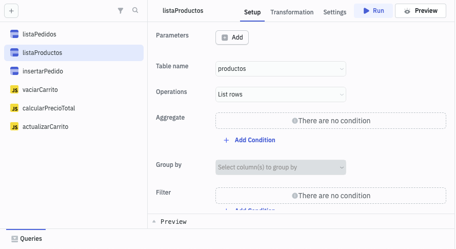

## 5.2 Creación de la página `Productos`

Añadimos una nueva página a la aplicación que se llame `Productos`.

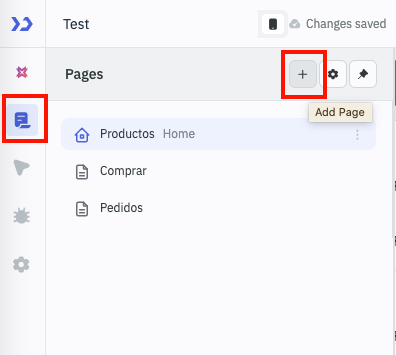

## 5.3 Añadimos los componentes necesarios para mostra los productos

### 5.3.1 Añadimos un componente `ListView`

En primer lugar, vamos a añdir un componente `ListView` a la página `Productos`.

En las propiedades del componente `ListView` vamos a seleccionar el campo `List data` y vamos a configurar la query `listarProdutos` que hemos creado anteriormente.

```
{{queries.listaProductos.data}}
```

Esto hará que el componente `ListView` muestre los datos que devuelve la query `listarProdutos`.

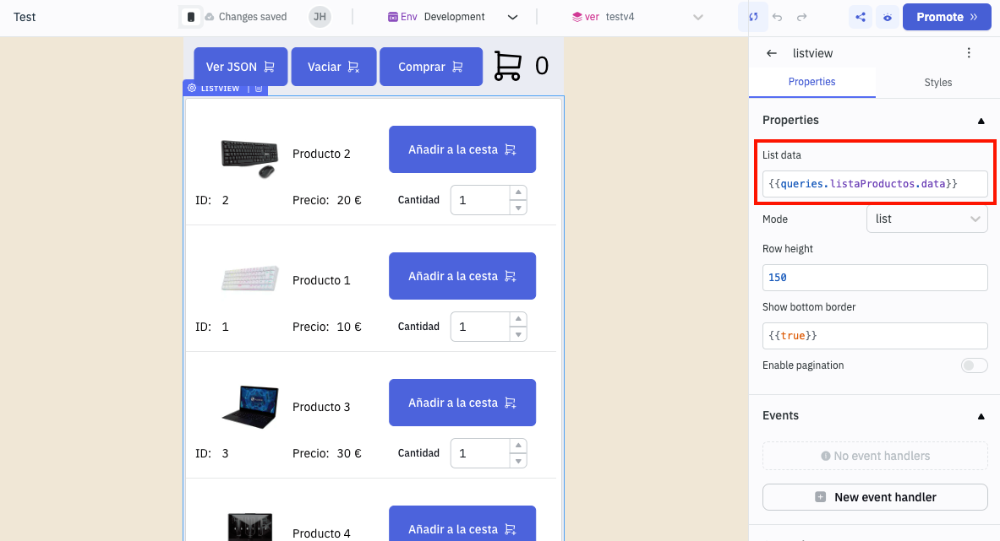

### 5.3.2 Añadimos un componente `Image`

Añadimos un componente de tipo `Image` y configuramos la propiedad URL para que muestre la imagen del producto.

```
{{listItem.imagen}}
```

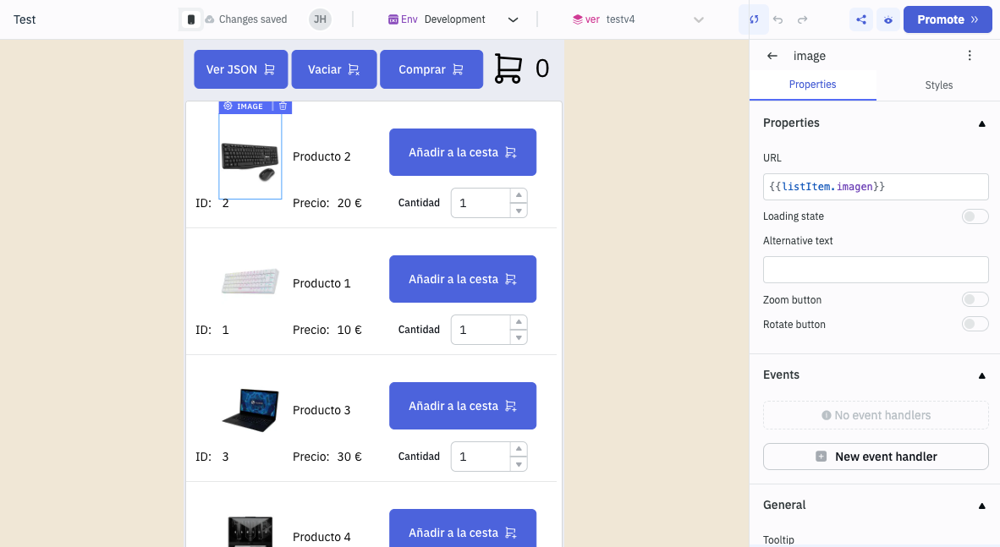

### 5.3.3 Añadimos los componentes `Text`

Añadimos 3 componentes de tipo `Text` para mostrar:

- el nombre, 
- el identificador, 
- el precio del producto.

**Nombre**

Configuramos la propiedad `Data` para mostrar el nombre del produto.

```
{{listItem.nombre}}
```

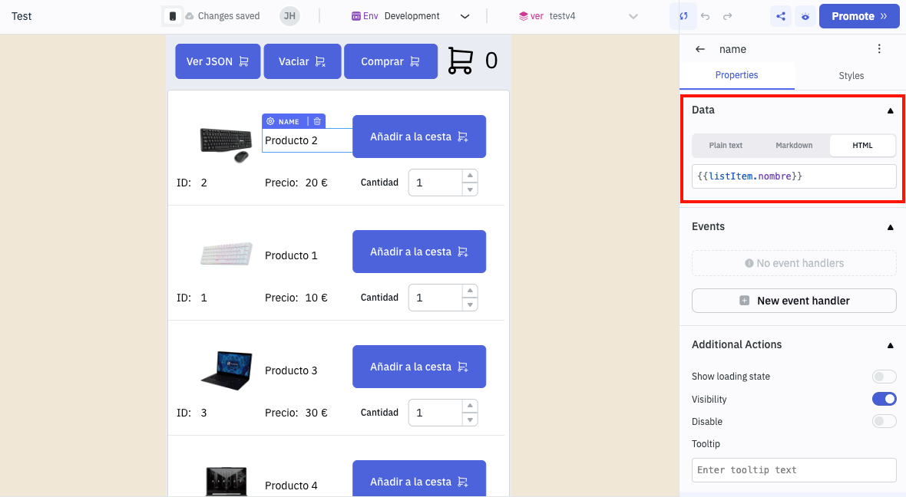

**Identificador**

Configuramos la propiedad `Data` para mostrar el identificador del producto.

```
{{listItem.id}}
```

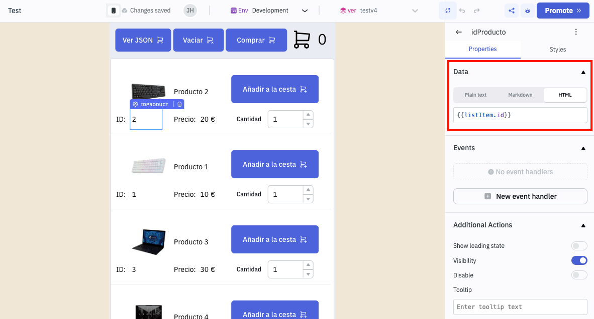


> [!NOTE]
> Hemos utilizado un componente `Text` auxiliar para mostrar el texto `ID`.

**Precio**

Configuramos la propiedad `Data` para mostrar el precio del producto.

```
{{listItem.precio}}
```

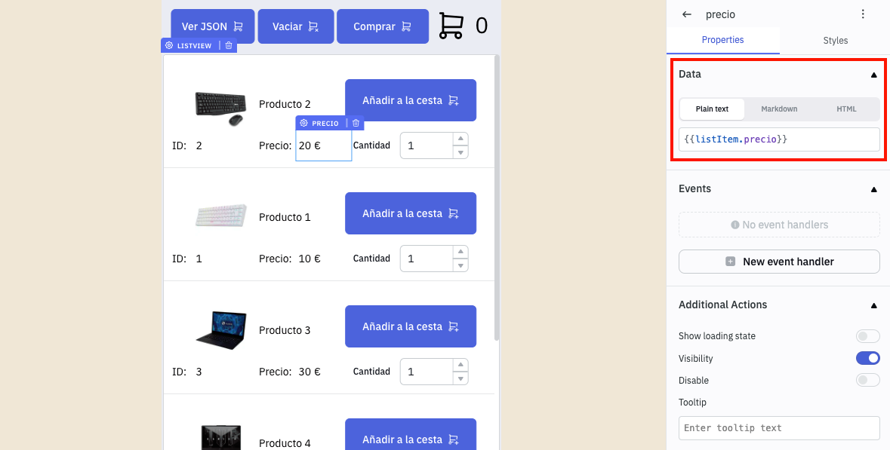

> [!NOTE]
> Hemos utilizado dos componentes `Text` auxiliares para mostrar el texto `Precio:` y el carácter `€`.

### 5.3.4 Añadimos un componente `Number Input`

Añadimos un componente de tipo `Number Input` para que el usuario pueda seleccionar la cantidad de productos que quiere añadir al carrito.

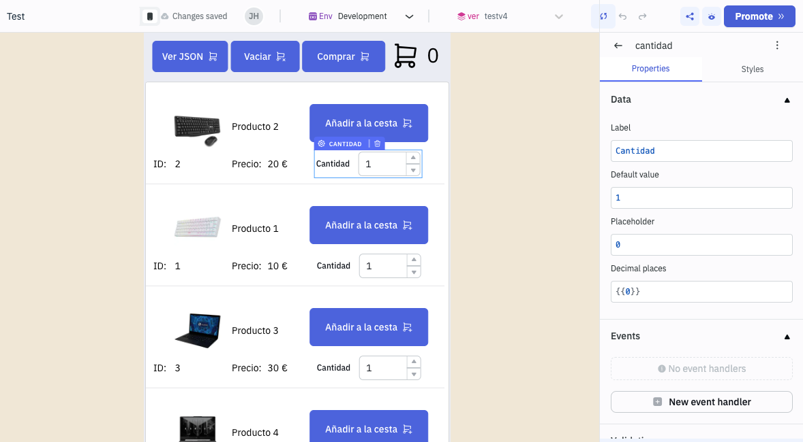

### 5.3.5 Añadimos un componente `Button`

Añadimos un componente de tipo `Button` para que el usuario pueda añadir el producto al carrito.

En este botón vamos a añadir un evento `onClick` para que cuando el usuario haga click sobre el botón se ejecute una Query, que en nuestro caso se llamará `actualizarCarrito`.

Esta query tiene que existir previamente para poder añadirla al evento `onClick`.

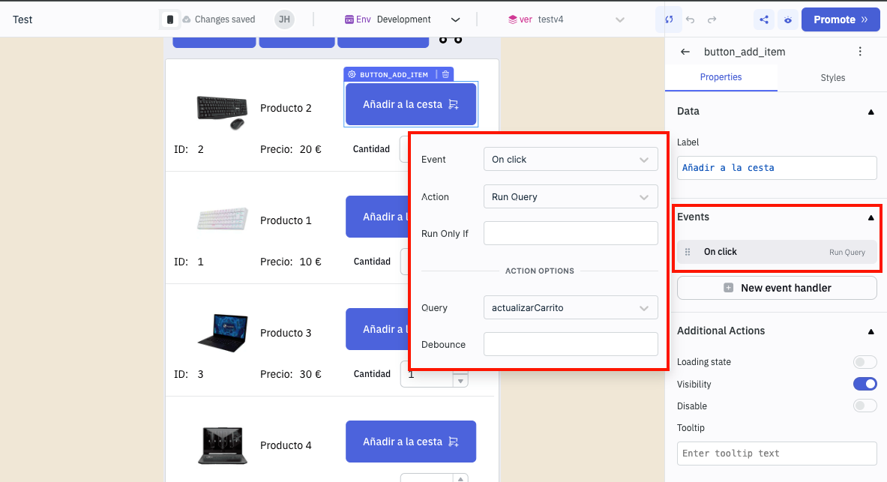

## 5.4 Creación de la query `actualizarCarrito` con JavaScript

Vamos a crear una query que se llame `actualizarCarrito` que permita ejecutar código JavaScript.

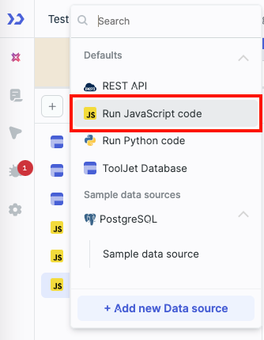

El código JavaScript que vamos a ejecutar es el siguiente:

```javascript
// Hacemos una copia mutable del array carrito
let carrito = [...(variables.carrito || [])];

// Obtenemos el id y la cantidad del ListView
let id = parseInt(components.listview.selectedRow.idProducto.text);
let cantidad = parseInt(components.listview.selectedRow.cantidad.value);
let precio = parseFloat(components.listview.selectedRow.precio.text);

// Buscamos si el id del producto ya existe en el carrito
let itemExistente = null;
let encontrado = false;
for (let i = 0; i < carrito.length; i++) {
  if (carrito[i].id === id) {
    itemExistente = carrito[i];
    encontrado = true;
    break;
  }
}

// Si el producto ya existe, actualizamos la cantidad
// y sino existe, lo añadimos
if (encontrado) {
  itemExistente.cantidad = cantidad;
} else {
  carrito.push({ "id": id, "cantidad": cantidad, "precio": precio });
}  

// Guardamos el estado del carrito
actions.setVariable('carrito', carrito)

// Sumamos la cantidad de items del carrito
let numeroProductos = 0;
for (let i = 0; i < carrito.length; i++) {
  numeroProductos = numeroProductos + carrito[i].cantidad;
}

// Guardamos el número total de productos
actions.setVariable('numeroProductos', numeroProductos)
```

> [!NOTE]
> Una vez que ha creado la query `actualizarCarrito` y ha añadido el código JavaScript, ya puede añadir esta query al evento `onClick` del botón `Añadir a la cesta`.

## 5.5 Configuramos que el script `actualizarCarrito` se ejecute al cargar la página

Para que el script `actualizarCarrito` se ejecute automáticamente al cargar la página, vamos a añadir un evento `On page load` a la página `Productos`.

En primer lugar, accedemos a la opción de `Events Handler` de la página `Productos`.

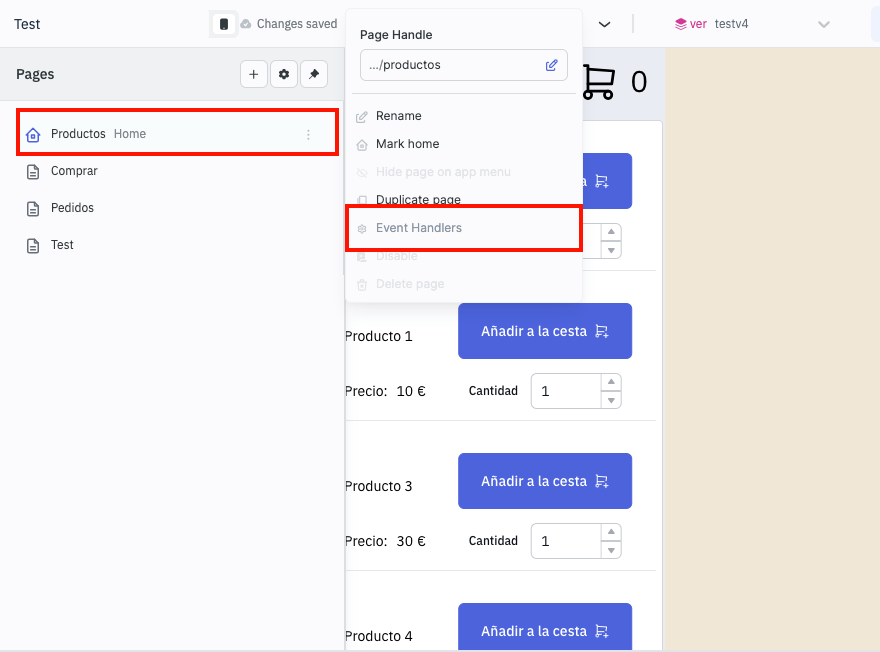

Creamos un nuevo evento de tipo `On page load` y añadimos la query `actualizarCarrito`.

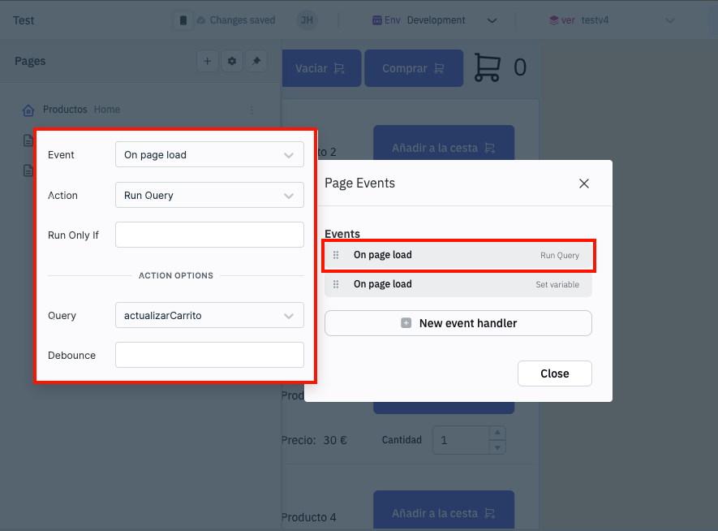

## 5.6 Añadimos los componentes de la parte superior de la página de productos

### 5.6.1 Número total de productos

En la parte superior de la página de productos vamos a añadir un componente `Text` para mostrar el número de productos.

Configuramos la propiedad `Data` para mostrar el número total de productos que tiene el carrito.

```
{{variables.numeroProductos}}
```

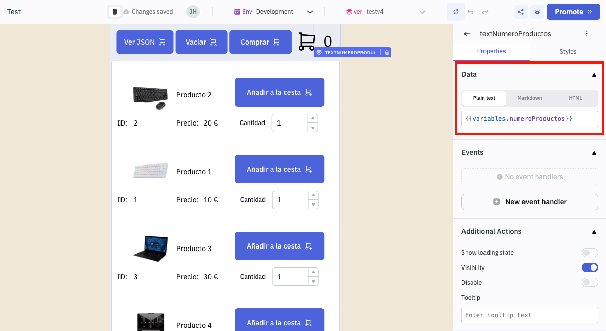


Para inicializar la variable global `numeroProductos` vamos a añadir un evento `On page load` a la página `Productos`.

En primer lugar, accedemos a la opción de `Events Handler` de la página `Productos`.


Ahora creamos un nuevo evento `On page load` y definimos la variable global `numeroProductos` con el valor `0`.


### 5.6.2 Botones `Ver JSON`, `Vaciar carrito` y `Comprar`

Además del número de productos, vamos a añadir tres componentes de tipo `Button`:

- **`Ver JSON`**: Muestra el contenido del carrito en formato JSON. Se ha añadido únicamente para facilitar la depuración de la aplicación.
- **`Vaciar carrito`**: Elimina todos los elementos del carrito.
- **`Comprar`**: Nos redirige a la página de tramitar el pedido.

**Ver carrito en formato JSON**

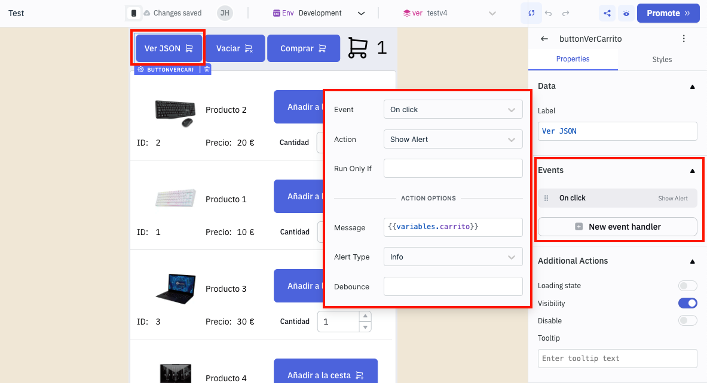

**Vaciar carrito**

En este botón vamos a configurar dos enventos `onClick`:

- Uno para ejecutar la query `vaciarCarrito`.
- Otro para mostrar un mensaje de confirmacion en un alert.

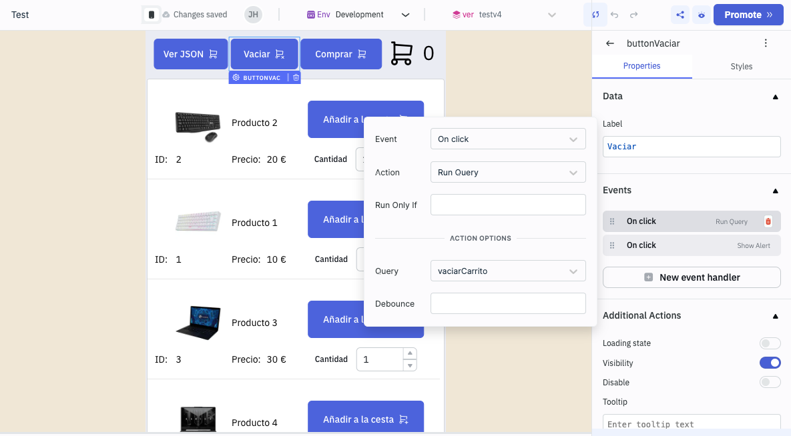

> [!NOTE]
> La query `vaciarCarrito` tiene que existir previamente para poder añadirla al evento `onClick`. La crearemos en el siguiente paso.

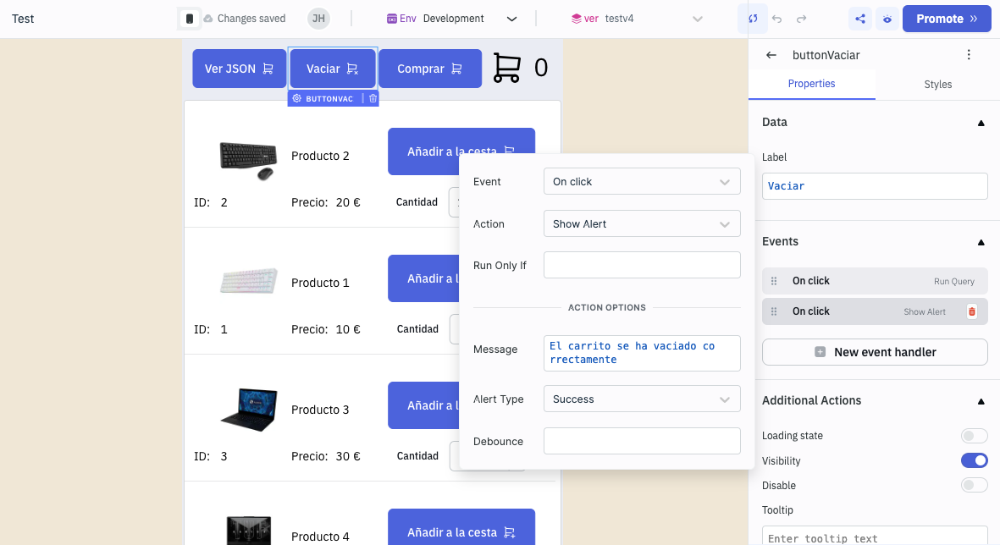

**Comprar**

Al pulsar sobre el botón de `Comprar` la aplicación nos redirige a la página `Comprar` para tramitar el pedido.

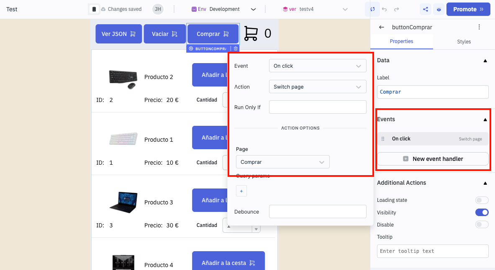

> [!NOTE]
> La página `Comprar` tiene que existir previamente para poder añadirla al evento `onClick`. La crearemos en el siguiente paso.

## 5.7 Creación de la query `vaciarCarrito`

Vamos a crear una query que se llame `vaciarCarrito` que permita ejecutar código JavaScript.


La query quedará así:

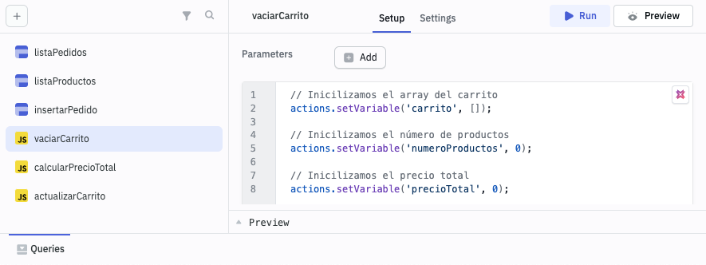

El código JavaScript que vamos a ejecutar es el siguiente:

```javascript
// Inicilizamos el array del carrito
actions.setVariable('carrito', []);

// Inicilizamos el número de productos
actions.setVariable('numeroProductos', 0);

// Inicilizamos el precio total
actions.setVariable('precioTotal', 0);
```

## 6. Creación de la página para tramitar el pedido

## 6.1 Creación de la página `Comprar`

Añadimos una nueva página a la aplicación que se llame `Comprar`.


## 6.2 Creación de la query `calcularPrecioTotal` con JavaScript

Vamos a crear una query que se llame `calcularPrecioTotal` que permita ejecutar código JavaScript.


La query quedará así:

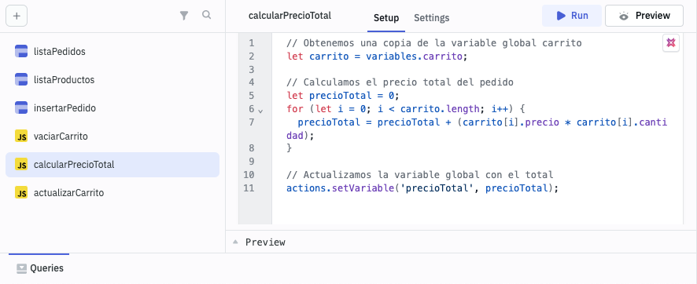

El código JavaScript que vamos a ejecutar es el siguiente:

```javascript
// Obtenemos una copia de la variable global carrito
let carrito = variables.carrito;

// Calculamos el precio total del pedido
let precioTotal = 0;
for (let i = 0; i < carrito.length; i++) {
  precioTotal = precioTotal + (carrito[i].precio * carrito[i].cantidad);
}

// Actualizamos la variable global con el total
actions.setVariable('precioTotal', precioTotal);
```

## 6.3 Configuramos que el script `calcularPrecioTotal` se ejecute al cargar la página de `Comprar`

Para que el script `calcularPrecioTotal` se ejecute automáticamente al cargar la página, vamos a añadir un evento `On page load` a la página `Comprar`.

En primer lugar, accedemos a la opción de `Events Handler` de la página `Comprar`.

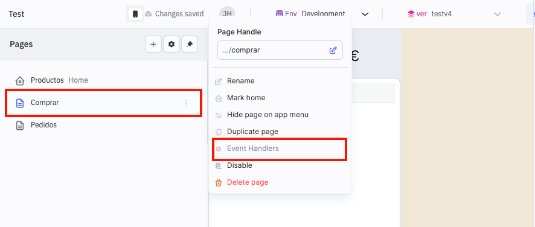

Creamos un nuevo evento de tipo `On page load` y añadimos la query `calcularPrecioTotal`.

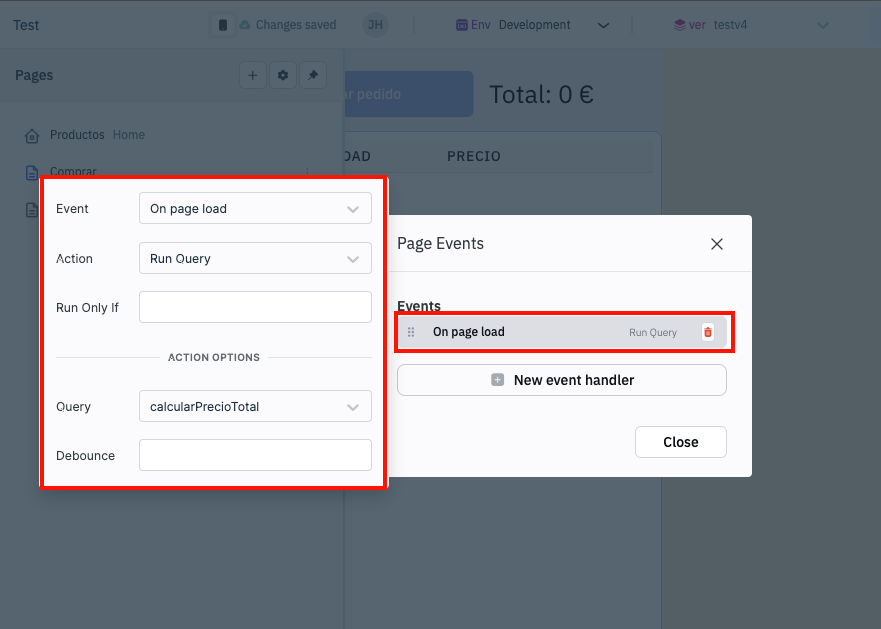

## 6.4 Añadimos los componentes necesarios

### 6.4.1 Añadir un componente `Table`

Añadimos un componente de tipo `Table` para mostrar el contenido del carrito.

Configuramos la propiedad `Data` para mostrar el contenido de la variable global `carrito`.

```
{{variables.carrito}}
```

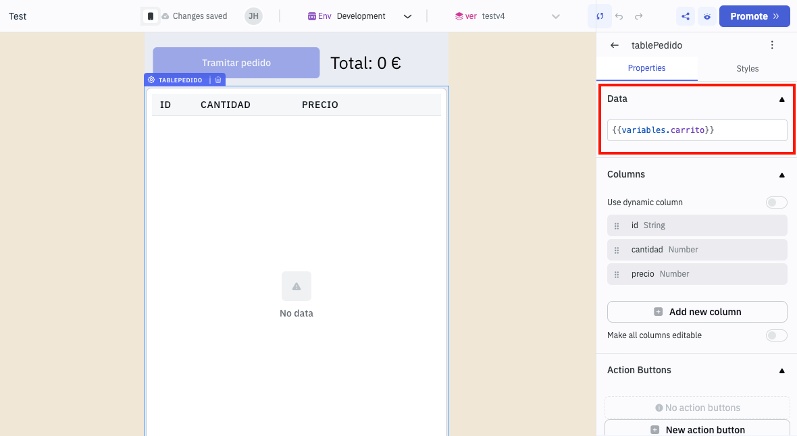

### 6.4.2 Añadir un componente `Text`

Añadimos un componente de tipo `Text` para mostrar el precio total del pedido.

Configuramos la propiedad `Data` para mostrar el precio total del pedido.

```
Total: {{variables.precioTotal}} €
```

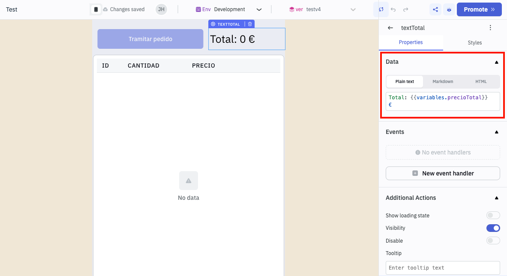

### 6.4.3 Añadir un componente `Button`

Añadimos un componente de tipo `Button` para que el usuario pueda tramitar el pedido.

En este botón vamos a añadir un evento `onClick` para que cuando el usuario haga click sobre el botón se ejecute una Query, que en nuestro caso se llamará `insertarPedido`.

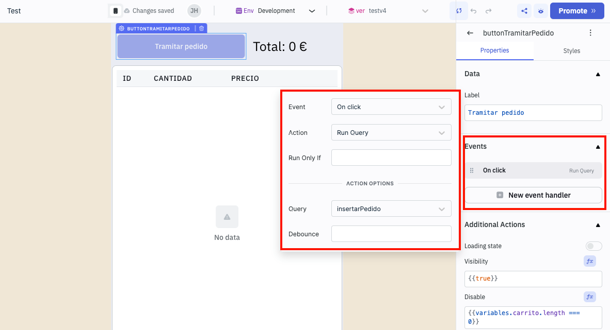

> [!NOTE]
> La query `insertarPedido` tiene que existir previamente para poder añadirla al evento `onClick`. La crearemos en el siguiente paso.

## 6.5 Creación de la query `insertarPedido`

Vamos a crear una query que se llame `insertarPedido` que permita insertar un pedido en la tabla `pedidos`.

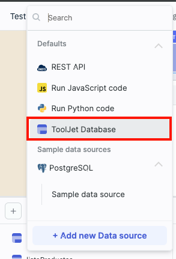

Configuramos la query para que inserte un nuevo pedido
en la tabla `pedidos`.

En la pestaña `Setup` tenemos que indicar qué datos se van a insertar en cada una de las columnas:

- `fecha`: `NOW()`
- `total`: `{{parseFloat(variables.precioTotal)}}`
- `carrito`: `{{variables.carrito}}`
- `id_usuario`: `{{globals.currentUser.id}}`

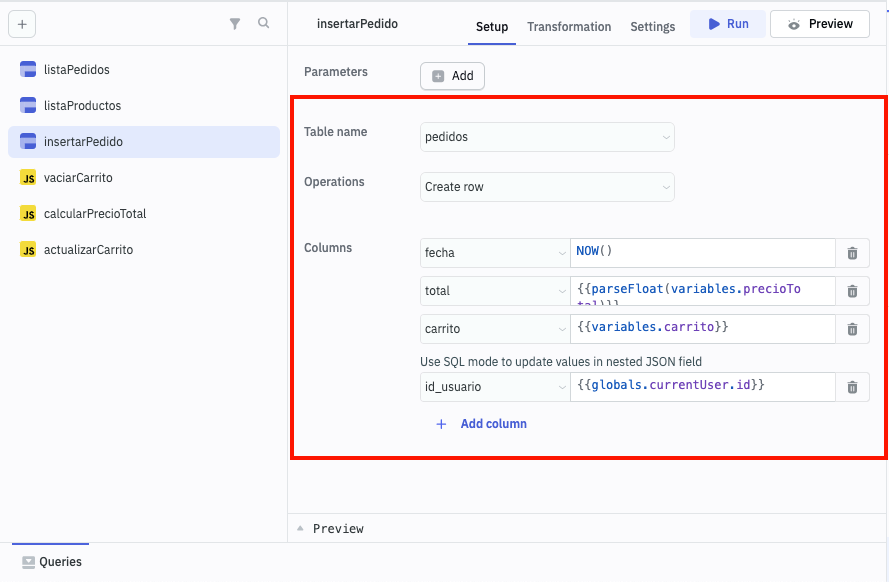

En la pestaña `Settings` configuramos los algunos eventos:

- `Query success`: Mostramos un mensaje al usuario indicando que el pedido se ha tramitado correctamente.

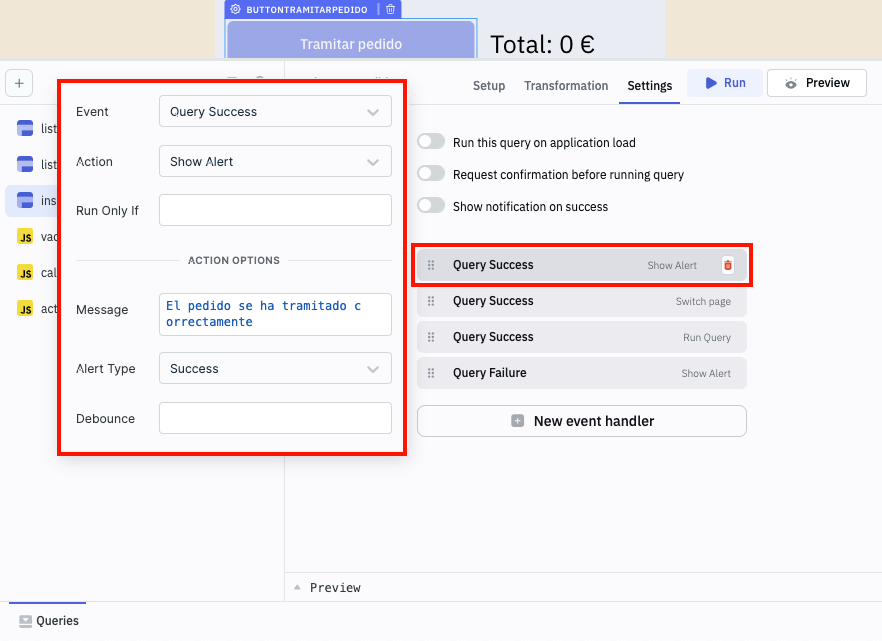

- `Query success`: Redirigimos al usuario a la página principal donde se muestra el listado de productos.

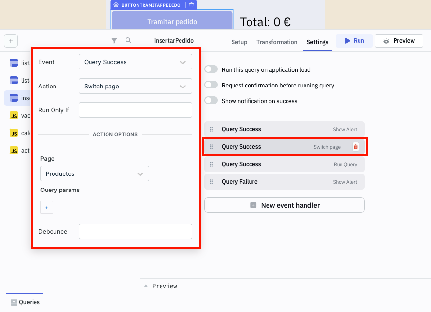

- `Query success`: Ejecutamos la query `vaciarCarrito` para vaciar el carrito.

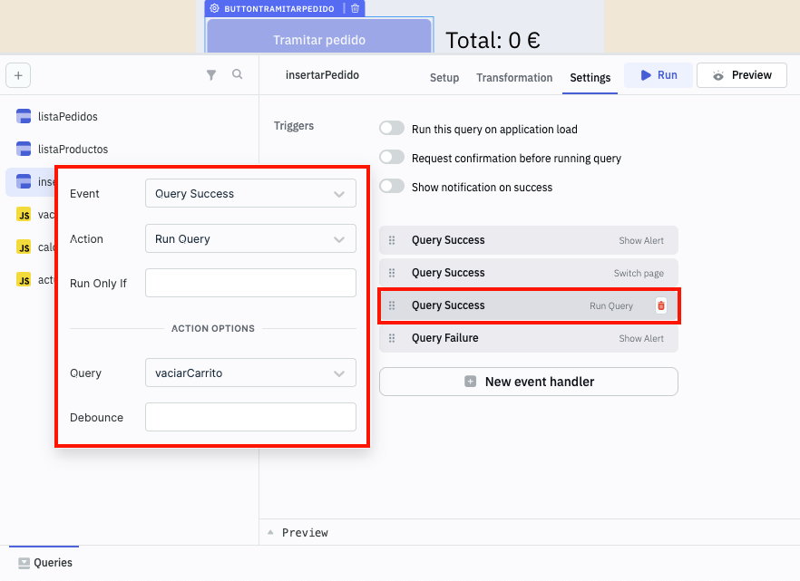

- `Query Failure`: Mostramos un mensaje al usuario indicando que ha habido un error al tramitar el pedido.

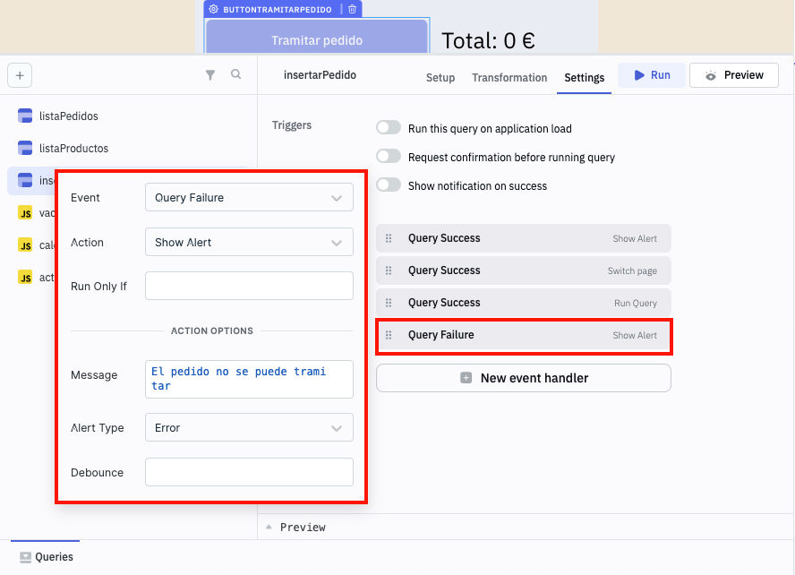

# 7. Configuración de la página de pedidos

## 7.1 Creación de la query `listaPedidos`

Vamos a crear una query a la que vamos a llamar `listaPedidos`, que nos permita obtener una lista de los pedidos que hay en la base de datos.

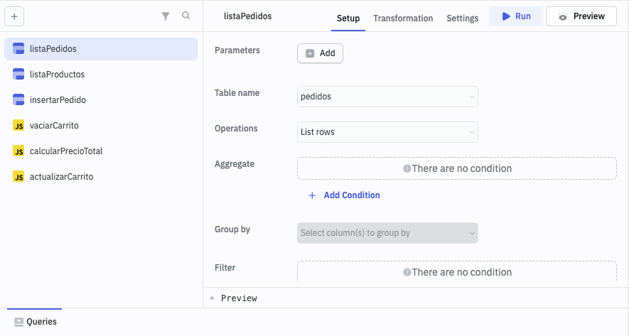

## 7.2 Creación de la página `Pedidos`

Añadimos una nueva página a la aplicación que se llame `Pedidos`.


## 7.3 Configuramos que la query `listaPedidos` se ejecute al cargar la página de `Pedidos`

Accedemos a la opción de `Events Handler` de la página `Pedidos`.

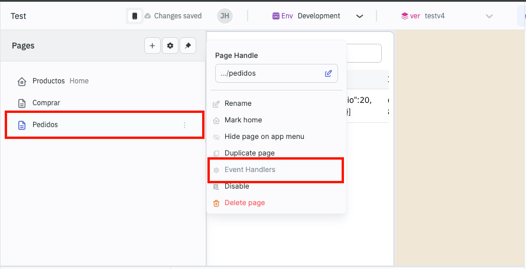

Creamos un nuevo evento de tipo `On page load` y añadimos la query `listaPedidos`.

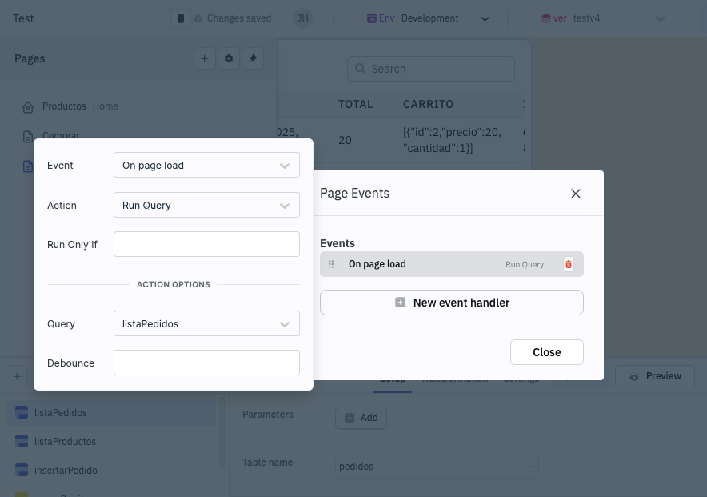

## 7.4 Añadimos los componentes necesarios

### 7.4.1 Añadir un componente `Table`

Vamos a añdir un componente `Table` a la página `Pedidos`.

En las propiedades del componente `Table` vamos a seleccionar el campo `Data` y vamos a configurar la query `listaPedidos` que hemos creado anteriormente.

```
{{queries.listaPedidos.data}}
```

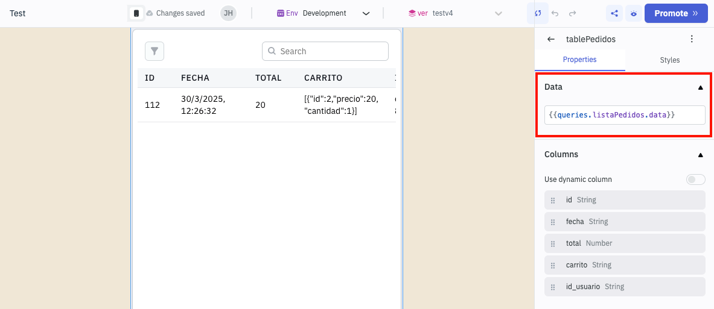

# Referencias

- [ToolJet][0]
- [Low-code development platform][2]

# Licencia

<a rel="license" href="http://creativecommons.org/licenses/by-nc-sa/4.0/"></a><br />Este obra está bajo una <a rel="license" href="http://creativecommons.org/licenses/by-nc-sa/4.0/">licencia de Creative Commons Reconocimiento-NoComercial-CompartirIgual 4.0 Internacional</a>.

[0]: https://www.tooljet.ai
[1]: https://www.ual.es/estudios/grados/presentacion/plandeestudios/asignatura/4015/40153316
[2]: https://en.wikipedia.org/wiki/Low-code_development_platform