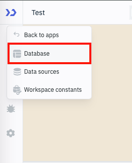
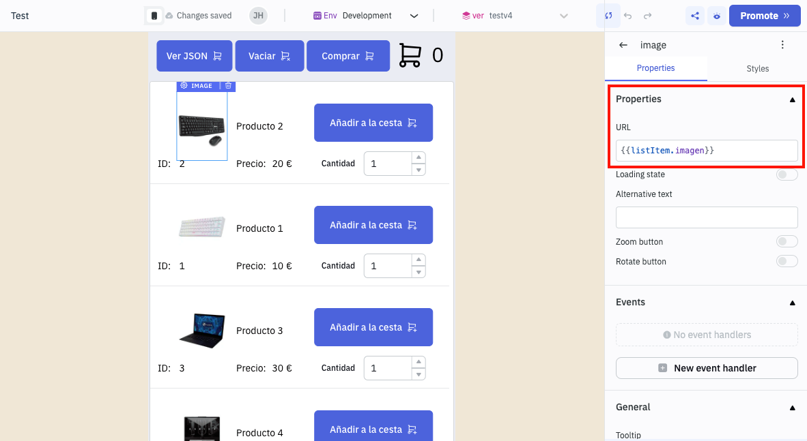

# Seminario de ToolJet

Repositorio para el seminario de [ToolJet][0] de la asignatura de [Negocio Electrónico][1].

# Índice de contenidos

- [1. ¿Qué es ToolJet?](#1-qué-es-tooljet)
- [2. Descripción de la aplicación](#2-descripción-de-la-aplicación)
- [3. Mockups de la aplicación](#3-mockups-de-la-aplicación)
  - [3.1 Listado de productos](#31-listado-de-productos) 
  - [3.2 Añadir productos al carrito](#32-añadir-productos-al-carrito) 
  - [3.3 Ver el estado del carrito en formato JSON](#33-ver-el-estado-del-carrito-en-formato-json) 
  - [3.4 Vaciar el carrito](#34-vaciar-el-carrito)
  - [3.5 Comprar](#35-comprar)
  - [3.6 Menú de navegación](#36-menú-de-navegación)
  - [3.7 Listado de pedidos](#37-listado-de-pedidos)
- [4. Creación de las tablas de la base de datos](#4-creación-de-las-tablas-de-la-base-de-datos)
  - [4.1 Tabla `productos`](#41-tabla-productos)
  - [4.2 Tabla `pedidos`](#41-tabla-pedidos)
  - [4.3 Inserción de datos en la tabla `productos`](#5-inserción-de-datos-en-la-tabla-productos)
- [5. Creación de la query `listarProdutos`](#6-creación-de-la-query-listarprodutos)

# 1. ¿Qué es ToolJet

[ToolJet][0] es una [plataforma de desarrollo low-code][2] de código abierto que permite crear aplicaciones y paneles de control de forma rápida, permtiendo a conexión con diferentes fuentes de datos.

# 2. Descripción de la aplicación

En este seminario vamos a desarrollar una aplicación que simula una tienda online.

La aplicación consta de tres páginas:

1. **Productos**: Listado de productos.
2. **Comprar**: Página donde muestra el contenido del carrito y se tramita el pedido.
3. **Pedidos:** Listado de pedidos realizados.

La aplicación **es un prototipo** que le ayudará a realizar la práctica 3 de la asignatura de [Negocio Electrónico][1].

# 3. Mockups de la aplicación

## 3.1 Listado de productos

La página principal de la aplicación muestra un listado de productos disponibles
en la base de datos.


## 3.2 Añadir productos al carrito

1. En la lista de productos podemos modificar la cantidad de cada tipo que queremos
añadir al carrito.

2. Para añadirlos hay que pulsar sobre el botón `Añadir a la cesta`.

3. En la esquina superior derecha se muestra el número de elementos que se han
añadido al carrito.


## 3.3 Ver el estado del carrito en formato JSON

El botón `Ver JSON` nos permite visualizar el estado del carrito en formato JSON.

Esta funcionalidad se ha añadido únicamente para facilitar la depuración de la
aplicación.


## 3.4 Vaciar el carrito

El botón `Vaciar carrito` nos permite eliminar todos los elementos del carrito.


## 3.5 Comprar

Cuando se pulsa sobre el botón `Comprar` la aplicación nos redirige a otra
página donde se muestra el contenido del carrito y podemos tramitar el pedido.


En esta página nos aparece una tabla con el resumen de la compra y el importe total del pedido.

Al pulsar sobre el botón `Tramitar pedido` el pedido se insertará en la base de datos y se vaciará el carrito.


Si el pedido se inserta con éxito nos aparecerá un mensaje de confirmación y redirigirá a la página principal.


## 3.6 Menú de navegación

La aplicación consta de tres páginas:

1. **Productos**: Listado de productos.
2. **Comprar**: Página donde muestra el contenido del carrito y se tramita el pedido.
3. **Pedidos:** Listado de pedidos realizados.


## 3.7 Listado de pedidos

En esta página se muestra una tabla con todos los pedidos realizados por el cliente.


# 4 Creación de las tablas de la base de datos

Seleccionaremos la base de datos `ToolJet`:




Una vez seleccionada la base de datos, vamos a crear dos tablas:

- `productos`: Contiene los datos de los productos.
- `pedidos`: Contiene los datos de los pedidos realizados por el cliente.

## 4.1 Tabla `productos`


## 4.1 Tabla `pedidos`


Observe que el tipo de dato seleccionado para el carrito es `JSON`. 

Por ejemplo, un carrito con dos productos tendría el siguiente formato:

```json
[{"id": 1, "cantidad": 2, "precio": 10.0}, {"id": 2, "cantidad": 1, "precio": 5.0}]
```

## 4.3 Inserción de datos en la tabla `productos`

Una vez que hemos creado las tablas vamos a insertar algunos datos en la tabla `productos`.


# 5. Creación de la página principal con el listado de productos

## 5.1 Creación de la query `listarProdutos`

En primer lugar vamos a crear una query a la que vamos a llamar `listaProdutos`, que nos permita obtener una lista de los productos que hay en la base de datos.


## 5.2 Creación de la página `Productos`

Añadimos una nueva página a la aplicación que se llame `Productos`.


## 5.3 Añadimos los componentes necesarios

### 5.3.1 Añadir un componente `ListView`

En primer lugar, vamos a añdir un componente `ListView` a la página `Productos`.

En las propiedades del componente `ListView` vamos a seleccionar el campo `List data` y vamos a configurar la query `listarProdutos` que hemos creado anteriormente.

```javascript
{{queries.listaProductos.data}}
```

Esto hará que el componente `ListView` muestre los datos que devuelve la query `listarProdutos`.


### 5.3.2 Añadimos un componente `Image`

Añadimos un componente de tipo `Image` y configuramos la propiedad URL para que muestre la imagen del producto.

```
{{listItem.imagen}}
```



### 5.3.3 Añadimos los componentes `Text`

Añadimos 3 componentes de tipo `Text` para mostrar:

- el nombre, 
- el identificador, 
- el precio del producto.

**Nombre**

Configuramos la propiedad `Data` para mostrar el nombre del produto.

```
{{listItem.nombre}}
```


**Identificador**

Configuramos la propiedad `Data` para mostrar el identificador del producto.

```
{{listItem.id}}
```


> [!NOTE]
> Hemos utilizado un componente `Text` auxiliar para mostrar el texto `ID`.

**Precio**

Configuramos la propiedad `Data` para mostrar el precio del producto.

```
{{listItem.precio}}
```


> [!NOTE]
> Hemos utilizado dos componentes `Text` auxiliares para mostrar el texto `Precio:` y el carácter `€`.

### 5.3.4 Añadimos un componente `Number Input`

Añadimos un componente de tipo `Number Input` para que el usuario pueda seleccionar la cantidad de productos que quiere añadir al carrito.


### 5.3.5 Añadimos un componente `Button`

Añadimos un componente de tipo `Button` para que el usuario pueda añadir el producto al carrito.

En este botón vamos a añadir un evento `onClick` para que cuando el usuario haga click sobre el botón se ejecute una Query, que en nuestro caso se llamará `actualizarCarrito`.

Esta query tiene que existir previamente para poder añadirla al evento `onClick`.


## 5.4 Creación de la query para ejecutar código JavaScript

Vamos a crear una query que se llame `actualizarCarrito` que permita ejecutar código JavaScript.


El código JavaScript que vamos a ejecutar es el siguiente:

```javascript
// Hacemos una copia mutable del array carrito
let carrito = [...(variables.carrito || [])];

//alert(carrito);

// Obtenemos el id y la cantidad del ListView
let id = parseInt(components.listview.selectedRow.idProducto.text);
let cantidad = parseInt(components.listview.selectedRow.cantidad.value);
let precio = parseFloat(components.listview.selectedRow.precio.text);

// Buscamos si el id del producto ya existe en el carrito
let itemExistente = null;
let encontrado = false;
for (let i = 0; i < carrito.length; i++) {
  if (carrito[i].id === id) {
    itemExistente = carrito[i];
    encontrado = true;
    break;
  }
}

// Si el producto ya existe, actualizamos la cantidad
// y sino existe, lo añadimos
if (encontrado) {
  itemExistente.cantidad = cantidad;
} else {
  carrito.push({ "id": id, "cantidad": cantidad, "precio": precio });
}  

// Guardamos el estado del carrito
actions.setVariable('carrito', carrito)

// Sumamos la cantidad de items del carrito
let numeroProductos = 0;
for (let i = 0; i < carrito.length; i++) {
  numeroProductos = numeroProductos + carrito[i].cantidad;
}

// Guardamos el número total de productos
actions.setVariable('numeroProductos', numeroProductos)
```

> [!NOTE]
> Una vez que ha creado la query `actualizarCarrito` y ha añadido el código JavaScript, ya puede añadir esta query al evento `onClick` del botón `Añadir a la cesta`.

[0]: https://www.tooljet.ai
[1]: https://www.ual.es/estudios/grados/presentacion/plandeestudios/asignatura/4015/40153316
[2]: https://en.wikipedia.org/wiki/Low-code_development_platform
