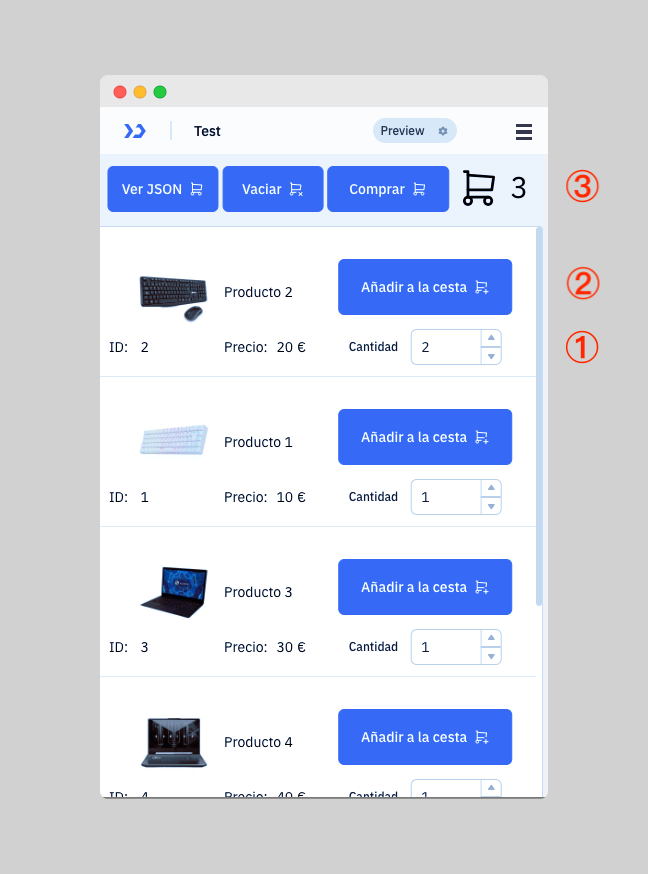

# Seminario de ToolJet

Repositorio para el seminario de [ToolJet][0].

# Índice de contenidos

# 1. ¿Qué es ToolJet

[ToolJet][0] es una [plataforma de desarrollo low-code][2] de código abierto que permite crear aplicaciones y paneles de control de forma rápida, permtiendo a conexión con diferentes fuentes de datos.

# 2. Descripción de la aplicación

En este seminario vamos a desarrollar una aplicación que simula una tienda online.

La aplicación consta de tres páginas:

1. **Productos**: Listado de productos.
2. **Comprar**: Página donde muestra el contenido del carrito y se tramita el pedido.
3. **Pedidos:** Listado de pedidos realizados.

La aplicación **es un prototipo** que le ayudará a realizar la práctica 3 de la asignatura de [Negocio Electrónico][1].

# 3. Mockups de la aplicación

## 3.1 Listado de productos

La página principal de la aplicación muestra un listado de productos disponibles
en la base de datos.

## 3.2 Añadir productos al carrito

1. En la lista de productos podemos modificar la cantidad de cada tipo que queremos
añadir al carrito.

2. Para añadirlos hay que pulsar sobre el botón `Añadir a la cesta`.

3. En la esquina superior derecha se muestra el número de elementos que se han
añadido al carrito.

## 3.3 Ver el estado del carrito en formato JSON

El botón `Ver JSON` nos permite visualizar el estado del carrito en formato JSON.

Esta funcionalidad se ha añadido únicamente para facilitar la depuración de la
aplicación.

## 3.4 Vaciar el carrito

El botón `Vaciar carrito` nos permite eliminar todos los elementos del carrito.

## 3.5 Comprar

Cuando se pulsa sobre el botón `Comprar` la aplicación nos redirige a otra
página donde se muestra el contenido del carrito y podemos tramitar el pedido.

En esta página nos aparece una tabla con el resumen de la compra y el importe total del pedido.

Al pulsar sobre el botón `Tramitar pedido` el pedido se insertará en la base de datos y se vaciará el carrito.

Si el pedido se inserta con éxito nos aparecerá un mensaje de confirmación y redirigirá a la página principal.

## 3.6 Menú de navegación

La aplicación consta de tres páginas:

1. **Productos**: Listado de productos.
2. **Comprar**: Página donde muestra el contenido del carrito y se tramita el pedido.
3. **Pedidos:** Listado de pedidos realizados.

## 3.7 Listado de pedidos

En esta página se muestra una tabla con todos los pedidos realizados por el cliente.

# 4 Creación de las tablas de la base de datos

Seleccionaremos la base de datos `ToolJet`:

Una vez seleccionada la base de datos, vamos a crear dos tablas:

- `productos`: Contiene los datos de los productos.
- `pedidos`: Contiene los datos de los pedidos realizados por el cliente.

## 4.1 Tabla `productos`

## 4.1 Tabla `pedidos`

# 5. Inserción de datos en la tabla `productos`

Una vez que hemos creado las tablas vamos a insertar algunos datos en la tabla `productos`.

# 6. Creación de la query `listarProdutos`

[0]: https://www.tooljet.ai
[1]: https://www.ual.es/estudios/grados/presentacion/plandeestudios/asignatura/4015/40153316
[2]: https://en.wikipedia.org/wiki/Low-code_development_platform